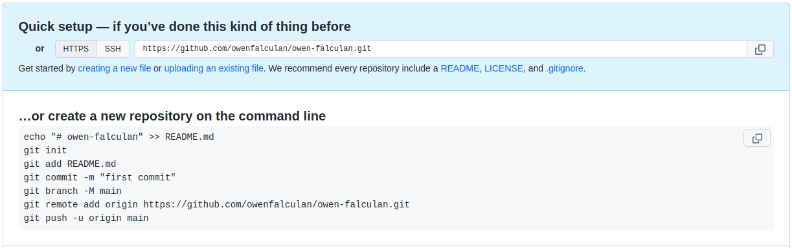
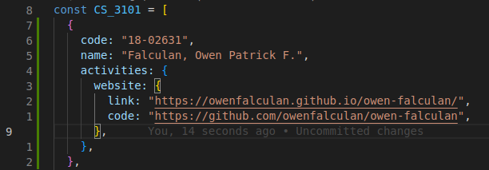

# Web Systems and Technologies Repository

## Easy method using Github Desktop

### Requirements

#### 1.Github Desktop

- Download Github Desktop [here](https://desktop.github.com/).

#### 2. Github

Create a GitHub Account and add your username here. You will be invited as a collaborator in this repository.

### Tutorial

Youtube Link [here](https://youtu.be/xLkhNVCnz-c).

<br>

## Manual Method using Git

### Requirements

#### 1. Git

- Download git [here](https://git-scm.com/downloads).
- Git Bash will be installed along with Git.
- Use Git Bash to enter git commands.

```
After installing git.
Open Git Bash and enter user config for git.
Enter the GitHub email you used.

Commands:
git config --global user.email "<your-email>"
git config --global user.name "<your-name>"

Example:
```


#### 2. Github

- Create a GitHub Account and add your username [here](https://docs.google.com/spreadsheets/d/1dbLlteb_eT49D2mW4nqbA3amqZcflPaSZ64H18HGgK8/edit?usp=sharing). You will be invited as a collaborator in this repository.

<br>

### Contributing

```
1. Deploy your personal website to GitHub Pages.
2. Submit your personal website link and the source code link.
```

<br>

### 1. Deploy your personal website to GitHub Pages.

```
Steps:
1. Create new repository on GitHub.
```


```
2. Add repository name. Repository must be public. Click create.
```


```
3. Upload your project to GitHub. Ignore the following commands:
echo "# owen-falculan" >> README.me
git add README.me

Note:
Execute these commands inside your project folder!
```



```
Use commands cd and ls to navigate.
cd - used to navigate between folders.
ls - list files and folders
```


```
Sample terminal commands
```


```
4. For windows users, if this window pops out when pushing your branch.
Just sign in with your browser and authorize git.
```


```
5. After pushing, your project files should be uploaded to your created GitHub repository.
```


```
6. Deploy your branch using GitHub Pages.
Click settings > pages > deploy master/main branch > save.
Your website link will be available after 30 seconds.
```


```
Note:
Your main HTML file should be named index.html
```

<br>

### 2. Submit your personal website link and the source code link.

<br>

```
Steps:
1. Open Git Bash (installed along with git) and clone our course repository.
Then navigate to the project using cd command.

Note:
Do not clone inside your personal website project!
```


```
1. Create a branch. Use your name as branch name (eg. owen-patrick-falculan).
Make sure that you are in your newly created branch.
To check, type "git branch" and your branch should be highlighted.
Do not make changes in master branch!
```


```
3. Edit variables.js file inside utils folder.
Look for your name and add your personal website link and source code link.
```



```
4. Add your changes to staging area.
Commit your changes.
Push your branch.

Commands:
git add .
git commit -m "<commit-message>"
git push --set-upstream origin <branch-name>
```


```
5.  After you pushed your branch in our repository.
Click compare and pull request.
Then click create pull request.
```


After I merged your pull request. Your website will be available [here](https://owenfalculan.github.io/web-systems-and-technologies/).


